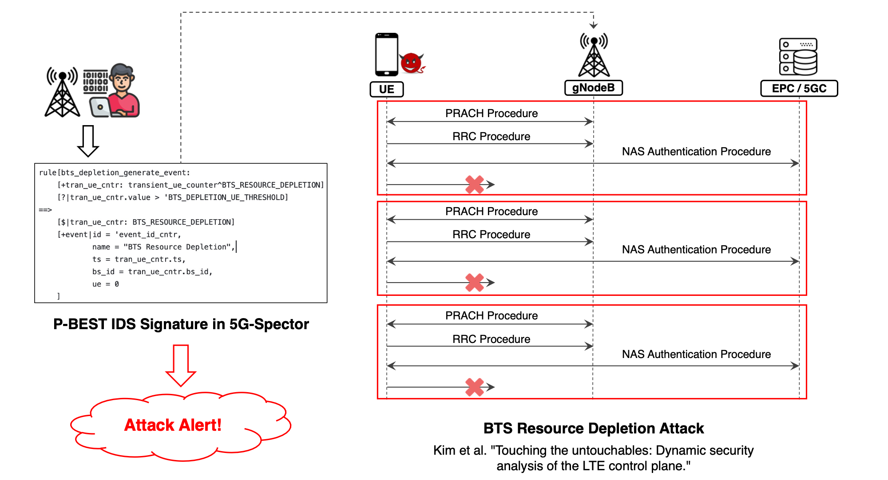

<!--
SPDX-FileCopyrightText: Copyright 2004-present Facebook. All Rights Reserved.
SPDX-FileCopyrightText: 2019-present Open Networking Foundation <info@opennetworking.org>

SPDX-License-Identifier: Apache-2.0
-->

# MobieXpert

MobieXpert is the first L3 cellular attack detection xApp deployed at O-RAN compliant near-RT RIC. 
MobieXpert’s design is based on the Production-Based Expert System Toolset ([P-BEST](https://ieeexplore.ieee.org/document/766911)) language, 
which has been widely used for decades in stateful intrusion detection. 
With MobieXpert, network operators can program stateful production-based IDS rules for detecting a wide range of cellular L3 attacks.

MobieXpert is an essential part of 5G-Spector. To get started and learn more about 5G-Spector, please refer to our 
[paper](https://web.cse.ohio-state.edu/~wen.423/papers/5G-Spector-NDSS24.pdf) in NDSS'24
and the [5G-Spector](https://github.com/5GSEC/5G-Spector) git repository.

MobieXpert is dedicated for the [ONOS RIC](https://docs.onosproject.org/v0.6.0/onos-cli/docs/cli/onos_ric/) on [SD-RAN](https://docs.sd-ran.org/master/index.html).
It is developed based on the [ONOS RIC's python SDK](https://github.com/onosproject/onos-ric-sdk-py) and guidance from the exemplar [ONOS RAN Intelligent Controller xApps](https://github.com/onosproject/onos-ric-python-apps/)  authored in Python programming language.
MobieXpert uses gRPC calls to obtain MobiFlow telemetry stream from the [MobiFlow Auditor xApp](https://github.com/5GSEC/MobiFlow-Auditor).

## Prerequisite

MobieXpert is built as a Docker container. Refer to the official tutorial (https://docs.docker.com/engine/install/) to install and set up the Docker environment.

Create a local docker registry to host docker images: 

```
sudo docker run -d -p 5000:5000 --restart=always --name registry registry:2
```

## IDS Programming with MobieXpert

MobieXpert’s programming capability is powered by the Production-Based Expert System Toolset ([P-BEST](https://ieeexplore.ieee.org/document/766911)) language.
The IDS rule file is located at [mobi-expert-xapp/pbest/expert/rules.pbest](./mobi-expert-xapp/pbest/expert/rules.pbest).

To get started with the P-BEST syntax, please refer to the P-BEST original paper: [Detecting computer and network misuse through the production-based expert system toolset (P-BEST)](https://ieeexplore.ieee.org/document/766911).

Below we provided an example of how [BTS Resource Depletion Attack](https://ieeexplore.ieee.org/document/8835363) could be detected by programming a P-BEST rule set which has been already integrated into [mobi-expert-xapp/pbest/expert/rules.pbest](./mobi-expert-xapp/pbest/expert/rules.pbest) from [line 433-536](./mobi-expert-xapp/pbest/expert/rules.pbest#L433).
Our original [paper](https://web.cse.ohio-state.edu/~wen.423/papers/5G-Spector-NDSS24.pdf) also describes how this rule sets were developed.



For example, the following P-BEST rule defined in `rules.pbest`  serves as an auxiliary rule for detecting BTS resource depletion attack:

```
rule[bts_depletion_add_first_transient_ue_5g:
    [+s:ue_session^TRANSIENT]
    [+ts_ev:ts_event]
    [?|s.nas_state == 1]                                        `NAS registering state
    [?|ts_ev.value - s.ts > 'BTS_DEPLETION_REG_INIT_TIME_THRESHOLD]
    [-transient_ue_counter|bs_id == s.bs_id]
    [-transient_ue|bs_id == s.bs_id, rnti == s.rnti]
==>
    [+transient_ue_counter|bs_id = s.bs_id, value = 1, ts = s.ts]
    [+transient_ue|bs_id = s.bs_id, rnti = s.rnti, ts = s.ts]
    [$|s:TRANSIENT]
    [!|debugprintf("[BTS Resource Depletion][ADD_FIRST_TRANSIENT_UE_5G] Marking UE %d/%x as transient\n", s.rnti, s.rnti)]
    [!|debugprintf("[BTS Resource Depletion][ADD_FIRST_TRANSIENT_UE_5G] Transient UE counter of bs %d is %d\n", s.bs_id, 1)]
]
```

This rule based on certain user-defined `xtype` structures in the P-BEST file. It determines whether a UE is a `transient UE` that explicits a layer-3 RRC DoS pattern.
From the rule, it leverages the MobiFlow features, i.e., the UE timers, and checks whether the session has been stuck at NAS registering state exceeding a time threshold `BTS_DEPLETION_REG_INIT_TIME_THRESHOLD`.
Then this rule will be triggered to add a transient UE instance and update the counters. The accumulated counters will then be evaluated to determine whether to trigger a BTS resource depletion attack alert.

## Build the MobieXpert xApp

After the new rules are integrated into [mobi-expert-xapp/pbest/expert/rules.pbest](./mobi-expert-xapp/pbest/expert/rules.pbest), you can use our Docker build script to build the MobiExpert xApp: 

```
./build.sh
```

After a successful build, the xApp will be compiled as a standalone Docker container.

```
$ docker images
localhost:5000/mobi-expert-xapp           latest    722a04c343b8   9 days ago     255MB
```

If your `rules.pbest` file contains syntax error, an exception will occur and fail the build process.

## Install the MobieXpert xApp

We have provided a default helm chart for deploying MobieXpert on the ONOS RIC via [Kubernetes](https://kubernetes.io/):

```
./install_xapp.sh
```

## Uninstall MobieXpert xApp

Undeploy the MobieXpert xApp from Kubernetes:

```
./uninstall_xapp.sh
```


## Publication

```
@inproceedings{5G-Spector:NDSS24,
  title     = {5G-Spector: An O-RAN Compliant Layer-3 Cellular Attack Detection Service},
  author    = {Wen, Haohuang and Porras, Phillip and Yegneswaran, Vinod and Gehani, Ashish and Lin, Zhiqiang},
  booktitle = {Proceedings of the 31st Annual Network and Distributed System Security Symposium (NDSS'24)},
  address   = {San Diego, CA},
  month     = {February},
  year      = 2024
}
```
